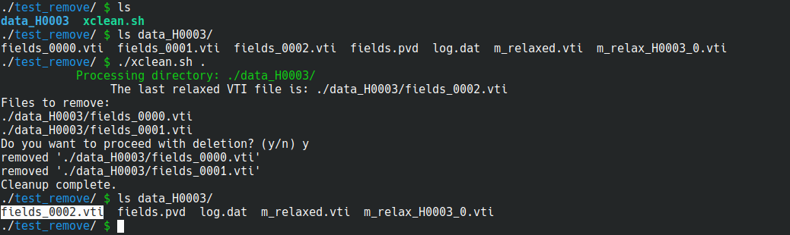
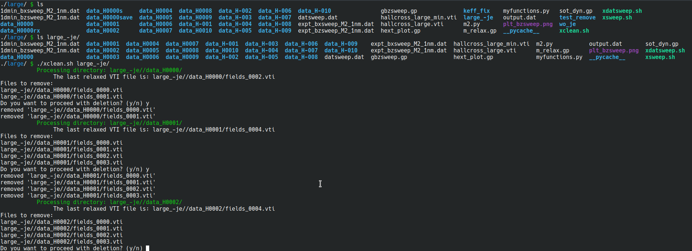

## xclean.sh

```bash
./xclean.sh target
```

Deletes all the prevoius `.vti` files stored in the `data` subdirectories from the target, just keeping the last `.vti` file. It crawls over the subdirectories inside the specified folder. Also it asks for deletion confirmation to avoid undesired loss of data.

```bash
./xclean.sh .
```


P.D. Remember it is a good practice to make periodic backup for any vital data ;)

Another example, of targeting not the current directory, but a subfolder:



