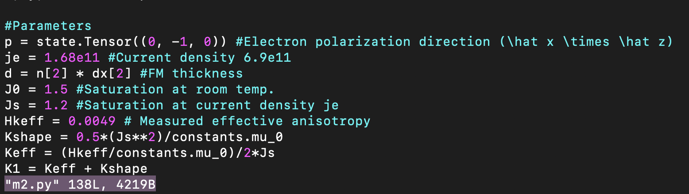

## My workflow for simulating field sweeps:

The way I run simulations here is: 
 1. Set up a new folder for putting the simulations in:

```bash
mkdir new_sim
```

 2. Pulling the scripts from the repo.
```bash
git clone https://github.com/joshuamsalazar/magnumnp-field-scan.git .
```

 3. Set up the structure geometry inside `m2.py` and material parameters.



 4.  Run a sample simulation with $H_\text{ext}=0 \text{ mT}$: 
 
```
python3 m2.py 0
```
 
 5. Check the generated `material.vti` file and data to see if it agrees with the desired structure.


 6. Run simulation in series for every external field amplitude:
 ```
./xsweep.sh m2.py -10 10 1
```
 
 7. Generate the dataset with the results, `datsweep.dat`, by calling:
```
./xdatsweep.sh
```

 8. _(Optional)_ Plot the magnetization dynamics results, `gmrx.gp`, for  $H_\text{ext}=0 \text{ mT}$ 
```
./xplot gmrx.gp 0
```