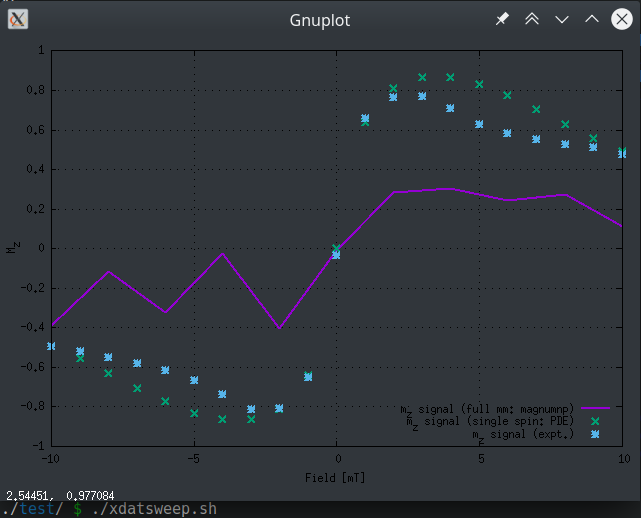

### Updater: `xdatsweep.sh`

Reads all the simulations for different field amplitudes and generates a datsweep.dat file with the relaxed magnetization directions at that state. Then, plots the generated dataset
```bash
./xdatsweep.dat
```

It will check all the generated folders (`data\_H\*\*\*\*`) from `xsweep.sh`, take the last line of the `data\_H\*\*\*\*/log.dat` and append it to a new `datsweep.dat` file. 

You can run it everytime you want to see the updated state of the simulations.



