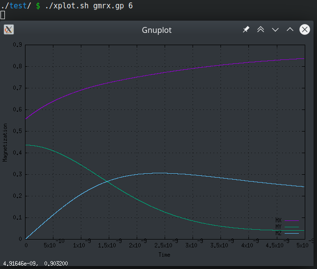

## xplot.sh

Generates and shows the desired plot (SOT fields, Hext, or magnetization). If you want to see the magnetization state of, the simulation at $H_\text{ext}=3$ mT:
```bash
./xplot gmrx.py 3
```

The script calls a `gnuplot` script containing the parameters for the plot. You can call whatever plot needed, three scripts are included as default:

| Script File  | Plot |
|--------------|-------------|
| g mrx .gp    | Relaxation of magnetization (\$\vec{m}\$ vs $t$) |
| g bsweep .gp | B field sweep (\$m_z\$ vs $H_\text{ext}$)       |
| g sot .gp | Torques dynamics (SOT vs $t$) |
| g hext .gp | Fields dynamics ($H_\text{ext}$ vs $t$) |

z.B.



Calling the function once will generate the plot in `./plt_mx_H-003.png`, show it and update it every 5 seconds. 
