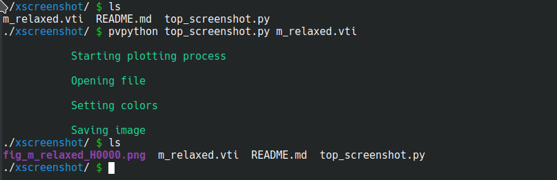
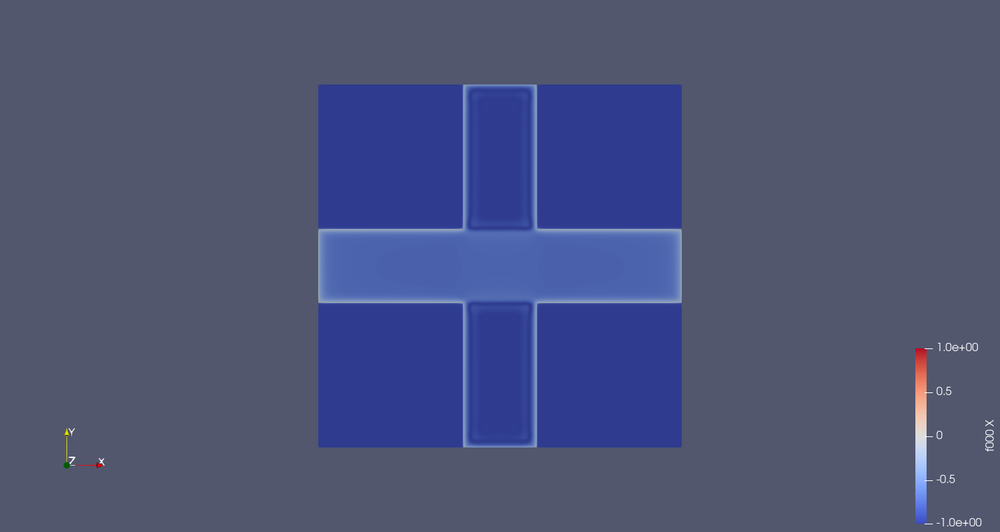

### xscreenshot.sh

This script automatically generates an screenshot of a top view of a vti file.

You can call it directly as:

```bash
./xscreenshot.sh -2
```
Where -2 is the external field value in mT.

The `.sh` script calls the following behind the scenes:

It uses the `pvpython` scripting application to work, so make sure you have Paraview installed and properly set up for you machine. You can find `pvpython` within the paraview\_X.x/bin in your Paraview installation directory. 

To test it: place `top_screenshot.py` and a `file.vti` within the Paraview\X.x/bin directory and run:

```bash
pvpython top_screenshot.py file.vti 
```

Where `file.vti` is the structure to load.



Then, the figure is generated based on the name of the file:


